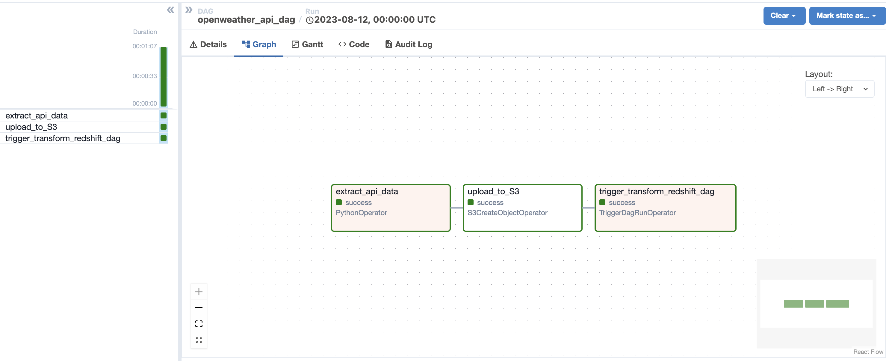
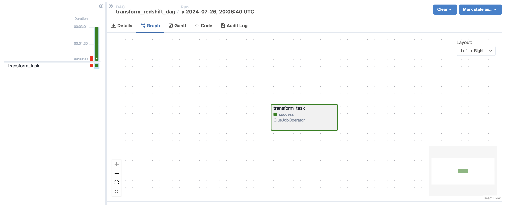
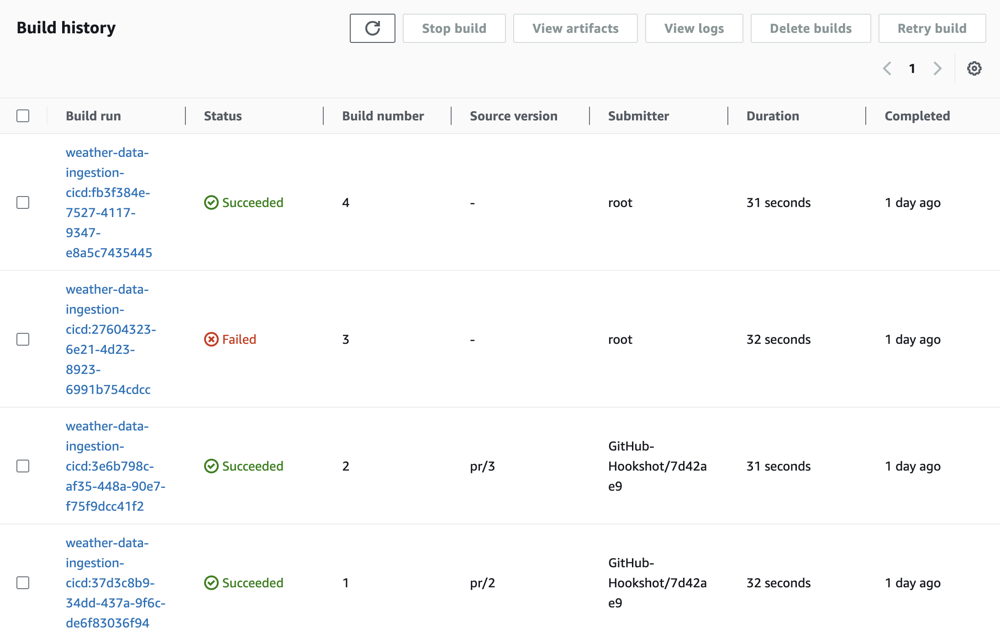
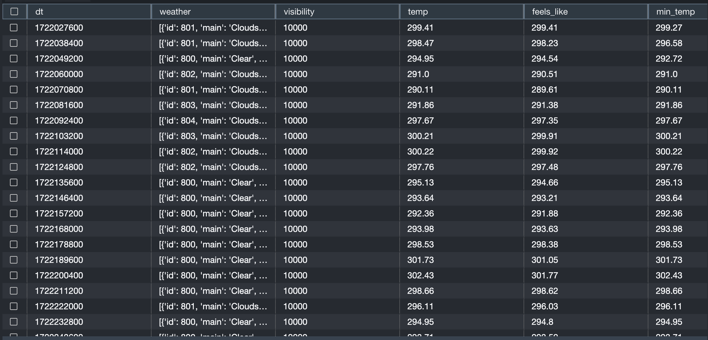

# AWS-Weather-Data-Ingestion

This project aims to automate the process of fetching, storing, processing, and loading weather data into a data warehouse using AWS managed services. The pipeline leverages AWS Managed Airflow, S3, Glue, and Redshift to ensure a scalable and efficient workflow. Additionally, a CI/CD pipeline is implemented to streamline code updates.

## OpenWeather API
The OpenWeather is a free API to fetch to fetch the weather data that might be suitable for most of applications, up to the complex enterprise systems. There are many options avaiable and I went with the one provides the five days forecast.
API Doc - https://openweathermap.org/forecast5

https://api.openweathermap.org/data/2.5/forecast is the API call that I use with filtering on the city as 'Toronto,Canada'.

## Solution Architecture

When a new sales data file is uploaded to the S3 bucket, an EventBridge rule triggers an AWS Step Functions workflow to process the file. Each record in the file is assessed in the step functions workflow using an AWS Lambda function to determine if it contains both order information and contact information.

If both order and contact information are present, the lambda function returns the record and is inserted into a DynamoDB table
by the workflow which can be used for further processing and storage.
If the contact information is missing, the lambda function raises an exception and the workflow places the record in a Dead Letter Queue (DLQ) in SQS for further inspection and correction.

### AWS Managed Airflow

Two DAGs are created for this project.

#### DAG-1 : openweather_api_fetch.py

- The DAG is configured to run daily, ensuring that fresh weather data is fetched and processed every day.
- The fetched data is saved as a CSV file into an S3 bucket using Hive-style partitioning.
- This dag triggers the second DAG which process this CSV file  

#### DAG-2 : transform_redshift_load.py

- Triggers a Glue job that Reads the latest CSV file in the bucket by looking for the folder name with latest date.
- The Glue job performs some schema transformations and loads the data to a redshift table.

Since, a single json file contains multiple records, multiple invokations of lambda function is required. To facilitate simultaneous running of the same lambda function, the lambda invoke is placed inside MAP state. all the tasks inside the map state will run simultaneously for each record in the JSON file. 

### Amazon S3

- Acts as the storage layer for raw weather data with date partitions.
- Stores the code for the dags and the glue script.
- State management: Uses AWS Step Functions to orchestrate the workflow and handle the logic for each record.
- Data integrity: Ensures only complete records are inserted into DynamoDB, while incomplete records are directed to an SQS DLQ.
- Scalability: Fully scalable to handle varying loads of sales data without manual intervention.

This setup provides a robust and efficient mechanism to manage sales data, ensuring high data quality and reliability.

### CI/CD Pipeline

- A CI/CD pipeline is created to automate code updates for the dags and the glue script.
- Whenever a pull request is merged into the main branch of the GitHub repository, AWS CodeBuild is triggered and the buildspec file is run.
- The code for the Glue script and the DAGs is updated in S3, ensuring the latest changes are deployed efficiently.

### Amazon Redshift

- The processed data from Glue is loaded into a Redshift table.
- Redshift serves as the data warehouse, enabling efficient querying and analysis of the weather data.

## Sample Run

#### Successfull Build after pull request was merged

#### Data in Redshift

